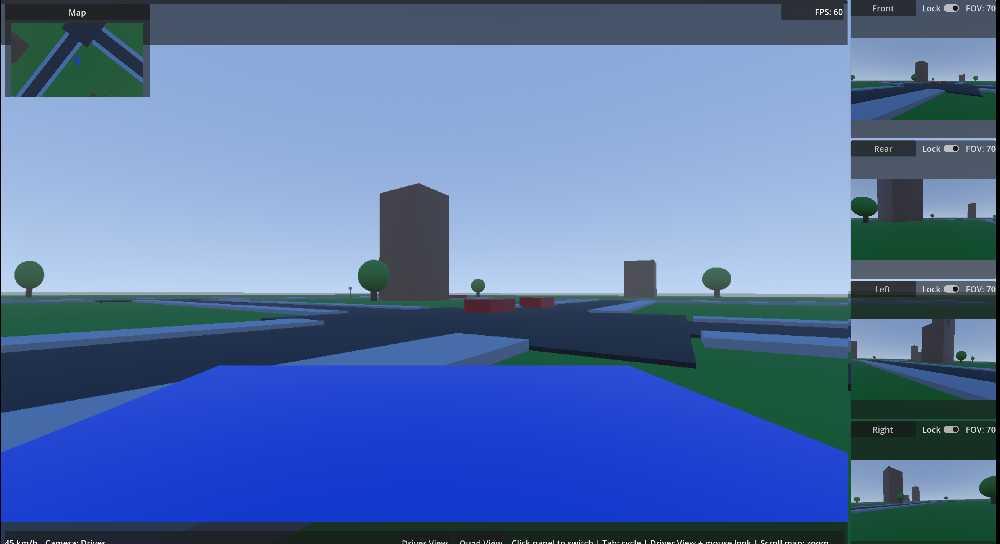

# Urban Car Simulation (Godot 4.6)

	

	Compact urban driving sandbox built in Godot 4.6 with arcade-style vehicle handling, looped NPC traffic, and a multi-camera HUD.

Compact urban driving sandbox built in Godot with:
- arcade-style player car physics,
- scripted NPC traffic on looped routes,
- multi-camera vehicle rig,
- HUD with live camera feeds, minimap, and camera controls.

## Engine and requirements
- Godot: 4.6.x (tested on 4.6.2-stable)
- Platform: Linux/Windows supported by Godot export targets
- External dependencies: none

## Current feature set

### Driving and vehicle physics
- Player car uses a custom `RigidBody3D` controller for throttle/brake/steer behavior.
- Stable movement with speed cap, lateral grip, angular stabilization, and reset behavior.
- Steering tuned for responsive arcade handling.

### NPC traffic
- NPCs are lightweight scripted traffic vehicles moving on waypoint-derived loops.
- NPC bodies are `StaticBody3D` with colliders so they can physically affect the player car.
- Follow-distance sensing via front raycasts for simple slow/stop spacing behavior.
- Route setup is robust to startup timing through deferred traffic initialization.

### Camera system
- Vehicle-mounted feeds: front, rear, left, right, and driver.
- Aerial helper feed used by minimap panel.
- Adjustable per-camera FOV with lock/sync behavior across locked panels.

### HUD and camera UX
- Main camera area + right-side camera stack + minimap + info bar.
- Click side panel to promote that feed to main view.
- Driver-view mouse-look with guarded click activation.
- New Quad View mode in main area (2x2 front/rear/left/right).
- Keyboard and button flow include single-feed views + quad mode.

## Controls

### Vehicle
- `W` / `Up`: accelerate
- `S` / `Down`: reverse
- `A` / `Left`: steer left
- `D` / `Right`: steer right
- `Space`: brake / handbrake
- `R`: reset vehicle
- `Esc`: quit

### Camera and HUD
- `Tab`: cycle main camera mode
	- `front -> rear -> left -> right -> driver -> quad`
- `Driver View` button: switch main view to driver camera
- `Quad View` button: toggle 2x2 quad main view
- Mouse wheel over minimap: zoom aerial camera
- Click inside driver main texture: toggle mouse-look on/off

## Run the project
1. Open this repository in Godot 4.6.x.
2. Ensure main scene is set to `res://scenes/main/main.tscn`.
3. Run the project.

## Project layout
- `scenes/main`: application root scene
- `scenes/world`: city block, roads, buildings, trees, environment
- `scenes/vehicles`: player, NPC, traffic manager
- `scenes/cameras`: vehicle camera rig
- `scenes/ui`: HUD and reusable camera panel UI
- `scripts/vehicles`: player/NPC controllers and vehicle helpers
- `scripts/traffic`: route construction and NPC spawning
- `scripts/cameras`: feed and rig behavior
- `scripts/ui`: HUD logic and panel behavior
- `docs`: design notes and implementation work log

## Key scripts
- `scripts/vehicles/player_car_controller.gd`: player physics and handling
- `scripts/vehicles/npc_car_controller.gd`: path-following NPC behavior
- `scripts/traffic/traffic_manager.gd`: waypoint/road collection and traffic spawn
- `scripts/cameras/vehicle_camera_rig.gd`: camera source/feed setup and sync
- `scripts/ui/hud_controller.gd`: HUD feed routing, mode switching, and UI events

## Debugging notes
- If NPCs seem missing, verify `WayPoints` markers in the city scene and traffic manager spawn count.
- If camera input feels wrong, verify current main mode (`driver`, single feed, or `quad`) in status text.
- If steering feel changes are needed, tune `steer_rate` and `max_steer_angle` in player controller.

## Status
Project is playable and modular, with clear extension points for:
- better traffic AI,
- richer vehicle physics,
- mission/gameplay loops,
- export packaging and release pipeline.
